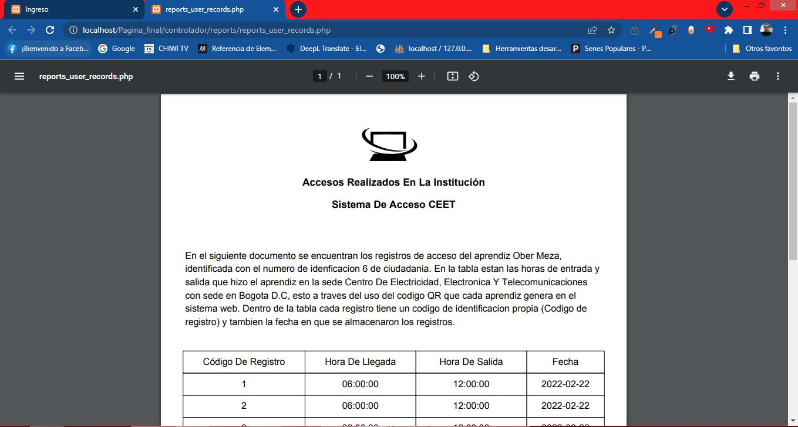
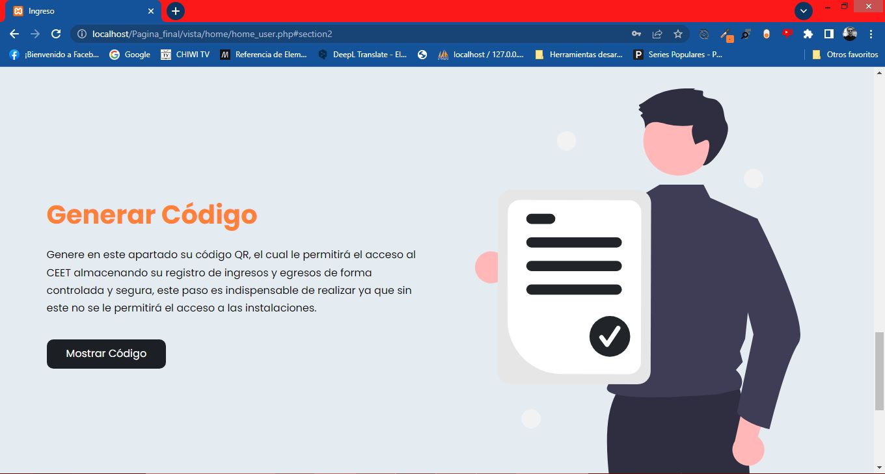

## Control de acceso
'Control de acceso' es un sistema de información enfocado a mejorar la seguridad y control de las personas que ingresan o salen de un establecimiento, a través de  de la implementación de este sistema podemos mejorar la seguridad de propios y visitantes. 
El sistema fue diseñado para ser una aplicación web de fácil uso.. 

## Access Control 
'Access Control' is an information system focused on improving the security and control of people entering or leaving an establishment, through the implementation of this system we can improve the safety of our own and visitors. 
The system was designed to be an easy to use web application.
## Caracteristicas

- Responsive
- Funciones dinámicas (botones, animaciones, iconos).
- Modo de pantalla completa.
- Sistema de login.
- Roles dentro del sistema (Admin, operador, usuario).
- Rol de admin puede ver registros y descargarlos en formato pdf.
- Rol de admin puede registrar nuevos usuarios y cambiar estados de 'activo' a 'inactivo' o 'inactivo' a 'activo'..
- Rol de operador puede escanear codigo QR para el ingreso y salida del usuario.
- Rol de usuario puede ver y generar reportes para descargarlos en formato pdf.
- Rol de usuario puede generar codigo QR para el ingreso y salida.

## Features
- Responsive
- Dynamic functions (buttons, animations, icons).
- Full screen mode.
- Login system.
- Roles within the system (Admin, operator, user).
- Admin role can view logs and download them in pdf format.
- Admin role can register new users and change status from 'active' to 'inactive' or 'inactive' to 'active'.
- Operator role can scan QR code for user entry and exit.
- User role can view and generate reports for download in pdf format.
- User role can generate QR code for entry and exit.

## Authors

- [@Dilson24](https://www.github.com/Dilson24) - Codificación y documentación.
- [@AlfonsoGamez](https://github.com/AlfonsoGamez) - Codificación y documentación.

## Screenshots
### Home

### Login

### Role Admin

### Role User

### Role Operator

### Responsive

## Tech
- [HTML5] - HyperText Markup Language, versión 5.
- [CSS] - Cascading Style Sheets.
- [Bootstrap] - Cross-platform library or open source toolkit for web site and application design.
- [JavaScript] -  Interpreted programming language.
- [PHP] - General-purpose programming language that is especially suited to web development.
- [MySQL] - Relational database management system.

# License
**Free Software, Hell Yeah!**
[MIT](https://choosealicense.com/licenses/mit/) © 2021-2022 Team 'Control de acceso' 

## Acknowledgements

 - [Servicio Nacional de Aprendizaje](https://www.sena.edu.co/)

 [JavaScript]: <https://lenguajejs.com/>
 [HTML5]: <https://lenguajehtml.com/html/>
 [CSS]: <https://lenguajecss.com/css/>
 [Bootstrap]: <https://getbootstrap.com/>
 [PHP]: <https://www.php.net/>
 [MySQL]: <https://www.mysql.com/>